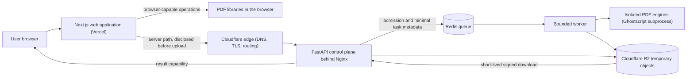

# Papyr

<picture>
  <source media="(prefers-color-scheme: dark)" srcset="docs/assets/papyr-hero-dark.svg">
  
</picture>

<p align="center">
  <a href=".github/workflows/ci.yml"></a>
  
  
  
</p>

<p align="center">
  
  
  
  
  
  
</p>

**Fast, private PDF tools.** Compress, merge, split, convert — five focused utilities that respect the user's time, files, and language. No accounts. No cloud history. Browser-first processing, with an explicit server path where native engines are required.

Papyr is a specification-first platform. This repository is the tested engineering foundation for the product: a strict Next.js web application with a shared trilingual shell, a typed FastAPI service, deployment templates, and security-gated continuous integration. The shared trilingual shell is available: English, Spanish, and Indonesian locale routing, accessible navigation, supporting route shells, and a localized 404 are implemented and tested. The five PDF tool workflows (compress, merge, split, JPG to PDF, PDF to JPG) are implemented and tested in this feature branch with localized routes; the backend service contracts including upload/enqueue endpoints, worker processing, threat scanning, R2 object lifecycle, cleanup coordination, and monitoring services are implemented and passing local gates. Production release requires merge to main and separate authorization — this branch implements the capability pending merge/deployment. Progress is tracked on the [roadmap](docs/roadmap.md).

**Start here:** [Product specification](docs/specifications/product.md) · [Technical architecture specification](docs/specifications/architecture.md)

## What Papyr is

Papyr exists to complete a common document task in seconds — without a general-purpose editor, an account wall, or a privacy tax. Three commitments define the product:

- **Fast and focused.** One clear primary action per page. Five tools with consistent upload, progress, and download experiences.
- **Private by default.** Anonymous use is a specified property of the catalogue: no account, no cloud history. Documents that can be processed locally never leave the device; server work is disclosed before upload and deleted no later than one hour after upload receipt.
- **Trilingual surface.** English, Spanish, and Indonesian are specified across every essential surface. The shared product shell that delivers them — locale routing, navigation, and supporting pages — is implemented and tested; localization across the five tool pages is implemented in this feature branch.

## The five specified tools

| Tool | Specified behaviour | Localized URLs |
| --- | --- | --- |
| **Compress PDF** | One automatic quality profile; reports original size, result size, and the actual percentage saved — never fabricated savings. | `/en/compress-pdf`, `/es/comprimir-pdf`, `/id/kompres-pdf` |
| **Merge PDF** | Ordered multi-file merge with reorder and removal before processing. | `/en/merge-pdf`, `/es/combinar-pdf`, `/id/gabungkan-pdf` |
| **Split PDF** | Custom ranges or one file per page, with deterministic validation of overlap, ordering, and range. | `/en/split-pdf`, `/es/dividir-pdf`, `/id/pisahkan-pdf` |
| **JPG to PDF** | Predictable page fitting with orientation respected; PNG and WebP as launch candidates. | `/en/jpg-to-pdf`, `/es/jpg-a-pdf`, `/id/gambar-ke-pdf` |
| **PDF to JPG** | Every requested page rendered at one documented quality profile. | `/en/pdf-to-jpg`, `/es/pdf-a-jpg`, `/id/pdf-ke-gambar` |

Each tool follows the shared workflow and state model defined in the product specification, and is browser-first where practical, with an explicit, disclosed server path where native engines or stronger isolation are required. Full behavioural contracts are published in the [product specification](docs/specifications/product.md). The three localized slugs above correspond to EN (English), ES (Spanish), and ID (Indonesian) routes implemented in this feature branch.

## Capability status

Papyr labels every claim so the repository can be read honestly: the source tree and its tests are the authority for what exists today, and the specifications are the authority for what is designed.

| Label | Meaning |
| --- | --- |
| **Available now** | Implemented, tested, and present in the source tree. |
| **Specified** | Contract published in the specifications and accepted as target behaviour. |
| **Planned** | Directional intent; implementation is not scheduled or started. The contract may already be published in the specifications. |
| **In branch** | Feature branch implementation present in this repository branch but not yet merged to main or deployed to production. |

| Capability | Status |
| --- | --- |
| Next.js application foundation with strict TypeScript, lint, format, unit-test, E2E, and build gates | Available now |
| Shared trilingual shell: English, Spanish, and Indonesian locale routing with persistent preference, Navbar, Footer, LanguageSwitcher, and SkipLink navigation, a localized homepage, supporting route shells, and a localized 404, with unit and Playwright E2E gates | Available now |
| Legal, support, and status route shells (privacy, terms, cookies and advertising, contact, status, roadmap) | Available now |
| Blog route shell | Available now |
| Typed FastAPI service foundation: app factory, strict configuration, request correlation, stable error envelope, validation schemas, task state machine, and health and readiness endpoints | Available now |
| Public-safe Docker Compose, Nginx, and environment templates | Available now |
| CI quality, security, and repository QA gates: format, lint, coverage, build, Playwright E2E, Trivy, gitleaks, dependency and package audits, and QA checks for action pins, Dockerfiles, Compose, YAML, markdown, and shell | Available now |
| Product, architecture, security, integration, and roadmap documentation | Available now |
| Five-tool catalogue (Compress, Merge, Split, JPG to PDF, PDF to JPG) | In branch |
| Localization across the five tool pages — English, Spanish, Indonesian | In branch |
| Versioned `/api/v1` endpoints: capabilities, task status, and signed downloads | Available now |
| Cloudflare R2 temporary-object lifecycle with a one-hour retention target | Available now |
| Ghostscript compression subprocess (official, unmodified distribution) | In branch |
| Per-tool limits and stable error categories | Available now |
| Upload/enqueue endpoints, five-tool executors, worker dispatch, ClamAV threat scanning, cleanup coordination, and monitoring | In branch |
| Shared upload, progress, error, and download experience | Planned |
| Full legal, support, and status content and functionality | Planned |
| Privacy-reviewed analytics schema with redaction and leakage tests (PT-01) | In branch |
| Reserved-dimension Adsterra ad placement with layout/placement guards (PT-02) | In branch |
| Categorized contact form and result-problem report with anti-spam (PT-03) | In branch |
| Memory-only encrypted-PDF password handling (PT-04) | In branch |
| Backend contact delivery endpoint with server-side validation, rate limiting, Turnstile siteverify, and Cloudflare Email Sending (PT-03) | In branch |
| Blog publishing programme | Planned |
| Redis queue and bounded worker processing | Available now |
| Privacy-safe structured logging and minimal-metadata task records | Available now |
| Production deployment and release procedures | Planned |

## Architecture

Papyr separates four concerns: the web application, the API control plane, the processing plane, and the object lifecycle. The web application and backend are independently deployable, and CI is not a deployment mechanism.



Native engines never execute on the asynchronous API event loop. Workers run with per-job CPU, memory, wall-clock, file-count, and page-count limits, ephemeral writable directories, no unrelated network access, and no provider credentials. Temporary objects use opaque, non-identifying keys with application-driven deletion and a one-hour retention target.

The versioned backend contracts are implemented and tested: capabilities, task status, and signed downloads under `/api/v1`, backed by a Redis durable queue and minimal-metadata task store, a one-worker processing loop, adaptive fair-use controls, cleanup coordinator, and monitoring services. Upload/enqueue endpoints, tool execution via five executors, ClamAV threat scanning, and R2 lifecycle cleanup are implemented in this feature branch; production deployment requires merge to main and authorization.

For the complete target contracts, see the [technical architecture specification](docs/specifications/architecture.md) and the [architecture overview](docs/architecture.md).

## Privacy and security

Papyr is designed around a "documents stay yours" model. The following behaviours are product requirements, not marketing:

- **No account required.** The launch catalogue works anonymously with no cross-device cloud history.
- **Browser-first by default.** Documents that can be processed locally never leave the device.
- **Disclosed server processing.** When a workflow requires native engines or stronger isolation, the user is told before any upload begins.
- **Temporary by design.** Server-side objects use opaque keys with a hard maximum retention of one hour from upload receipt, with active deletion plus a storage-lifecycle safety net.
- **No document data in telemetry.** Filenames, contents, passwords, extracted text, and signed URLs are excluded from logs, analytics, and alerts.
- **Fail-closed errors.** Invalid, expired, unsupported, or unsafe work returns stable public error categories — never stack traces, engine details, or provider credentials.
- **Hardened delivery.** CI runs format, lint, coverage, a production build, Playwright E2E, Trivy (critical and high severity), full-history gitleaks, dependency and package audits, and repository QA checks across action pins, Dockerfiles, Compose, YAML, markdown, and shell. Third-party actions are pinned to immutable commit SHAs, jobs use read-only permissions, and CI never deploys.

The Phase 6 privacy, analytics, advertising, and support work extends the "no document data in telemetry" commitment to the client side: a closed-field analytics schema with a redaction pipeline and leakage tests, memory-only password handling for encrypted PDFs, and an Adsterra ad slot that never appears beside the Download control or on status/legal/support surfaces.

See the [security policy](SECURITY.md) for reporting guidance and the full control inventory.

## Quickstart

Requirements: Node.js 24+, Python 3.13+, and the package managers used by each workspace (`npm`, `pip`).

### Web application

```bash
cd frontend
npm ci
npm run dev             # http://localhost:3000
npm run test:coverage
npm run test:e2e        # Playwright E2E (builds and serves the app)
npm run build
```

### API service

```bash
cd backend
python -m venv .venv
# activate the virtual environment for your shell
pip install -r requirements.txt -r requirements-dev.txt
uvicorn app.main:app --reload   # http://localhost:8000/health and /health/ready
pytest tests/ --cov=app --cov-fail-under=80
```

The API service **fails fast at boot** if the five required environment variables are missing or empty (`backend/app/config.py`): `R2_ACCOUNT_ID`, `R2_ACCESS_KEY_ID`, `R2_SECRET_ACCESS_KEY`, `R2_BUCKET_NAME`, and `ALLOWED_ORIGINS`. The committed template sets these intentionally empty so an accidental load fails closed. Set real values out of band before running uvicorn or `pytest tests/` to avoid `MissingEnvVarError`; see [docs/environment-variables.md](docs/environment-variables.md) for the authoritative list and defaults.

### Repository guard

```bash
bash scripts/check-ci.sh
```

### Operations entrypoints (in branch; not yet active in production)

The branch adds a bounded worker entrypoint, a cleanup loop, a production monitor, and an R2 lifecycle policy gate under `backend/app/`. From `backend/` with dependencies installed:

```bash
python -m app.worker                          # worker claim loop + /health probe
python -m app.ops.cleanup_loop --once         # one bounded cleanup pass (--dry-run for drills)
python -m app.ops.cleanup_loop --watch 300    # continuous passes every 300 s, graceful shutdown
python -m app.ops.monitor                     # one-shot eight-check health report (JSON)
python -m app.ops.monitor --watch 60          # watch mode
python -m app.ops.r2_lifecycle --check ../deploy/r2-lifecycle.json
bash scripts/check-r2-lifecycle.sh            # repository gate for the lifecycle artifact
```

Exit codes are stable: `0` healthy/success, `1` failed check or pass, `2` configuration error.

The unified Compose topology (`deploy/docker-compose.yml`) declares `api` (profile `app`), `nginx` (profile `edge`), and `redis`, `workers`, `clamd`, `cleanup`, `monitor` (profile `queue`). Images are supplied at deploy time as immutable digest-form references (`PAPYR_API_IMAGE`, `PAPYR_WORKERS_IMAGE`, `PAPYR_CLAMD_IMAGE`); no digest is stored in source. Applying the R2 lifecycle policy to a live bucket remains a separately authorized deploy-time operator action (see `deploy/runbook-vps.md`).

## Deployment

Papyr deploys in two parts, and CI is never the deployment mechanism.

- **Frontend — Vercel.** The Next.js application is built and served from Vercel. The client always issues **same-origin** `/api/v1/*` requests; `frontend/next.config.ts` rewrites them to the backend origin from the build-time `NEXT_PUBLIC_API_BASE_URL` variable (default `https://api.mypapyr.com`). No CORS is needed in production because requests never leave the frontend origin.
- **Backend — a VPS behind Nginx.** The FastAPI service runs on a VPS via Docker Compose with immutable digest images. Nginx terminates the public `api.mypapyr.com` origin and proxies to FastAPI on port 3000. Images are supplied at deploy time as immutable digest-form references (`PAPYR_API_IMAGE`, `PAPYR_WORKERS_IMAGE`, `PAPYR_CLAMD_IMAGE`); no digest is stored in source.
- **Rollback.** A rollout is a pointer move: redeploy the previous digest for the affected service. No database migration is involved in the current topology.

Operators start at [deploy/runbook-vps.md](deploy/runbook-vps.md) (authoritative VPS deployment, environment provisioning, and rollout/rollback), with [docs/environment-variables.md](docs/environment-variables.md) for the required/optional variable contract, [docs/upgrade.md](docs/upgrade.md) for version upgrades, and [docs/ops-runbook.md](docs/ops-runbook.md) for day-to-day operations.

## Roadmap

The [roadmap](docs/roadmap.md) tracks the path from this foundation, through the delivered shared trilingual shell and the five-tool tool-page work, into the launch catalogue and the remaining platform services — queue, workers, object lifecycle, release procedures, and the Phase 6 privacy, analytics, advertising, and support work. It is directional, not a release commitment.

**Want to shape the product?** Contributions are welcome. Start with the [contribution guide](CONTRIBUTING.md), then pick up a specification issue.

## Repository layout

| Path | Purpose |
| --- | --- |
| `frontend/` | Next.js web application foundation. |
| `backend/` | Typed FastAPI service foundation. |
| `deploy/` | Public-safe Docker Compose, Nginx, and environment templates. |
| `.github/workflows/ci.yml` | CI-only quality and security gates. |
| `docs/specifications/` | Product and technical architecture specifications. |
| `docs/architecture.md` | Architecture overview. |
| `docs/integrations.md` | Third-party integration inventory. |
| `docs/roadmap.md` | Implementation status and planned milestones. |
| `scripts/` | Repository validation scripts. |

## Documentation

- [Product specification](docs/specifications/product.md)
- [Technical architecture specification](docs/specifications/architecture.md)
- [Architecture overview](docs/architecture.md)
- [Integration inventory](docs/integrations.md)
- [Roadmap](docs/roadmap.md)
- [Security policy](SECURITY.md)
- [Contribution guide](CONTRIBUTING.md)

## License and terms

This repository has no declared license. No `LICENSE` file is present, and the owner has not issued a written open-source license decision; until one is published, the source is provided for evaluation only and no reuse, modification, or redistribution rights are granted. Contributions are welcome under the [contribution guide](CONTRIBUTING.md); accepted contributions will be covered by the license the owner selects. See [docs/licensing.md](docs/licensing.md) for the dated decision record.

## Limitations

Papyr is under active development. The present source tree is an engineering foundation, not a completed PDF service or a production deployment. Specifications and roadmap entries describe intended behaviour — not guaranteed delivery dates and not currently available features.

The project does not claim legal compliance, certification, guaranteed malware removal, or suitability for a particular jurisdiction, security model, or regulated use case. Review the source, tests, and third-party dependencies for your own requirements before deployment.
