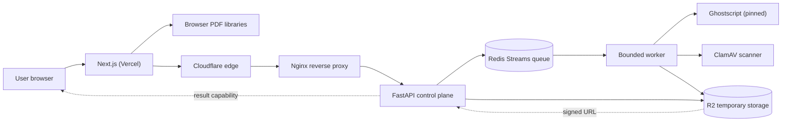

# Architecture overview

Papyr is designed as a browser-first PDF platform with an explicit, bounded server-processing path. This feature branch implements the frontend foundation (including the shared trilingual shell), the backend service foundation with its API, queue, storage contracts, deployment templates, and CI foundation described below. Native PDF processing via five tool executors, upload and enqueue endpoints, concrete threat scanning (ClamAV), worker dispatch, R2 object lifecycle cleanup, and monitoring services are implemented in this feature branch; production release requires merge to main and separate authorization. The five PDF workflows are implemented here with localized EN/ES/ID routes; progress is tracked on the [roadmap](roadmap.md).

## Current implementation

- A Next.js application with strict TypeScript and automated quality gates, including the shared trilingual shell: English, Spanish, and Indonesian locale routing with persistent preference, Navbar, Footer, LanguageSwitcher, and SkipLink navigation, a localized homepage, supporting route shells for privacy, terms, cookies and advertising, contact, status, roadmap, and blog, and a localized 404, with unit and Playwright E2E gates.
- A typed FastAPI service foundation: app factory with strict configuration, `GET /health` and `GET /health/ready` endpoints, request correlation headers, a stable error envelope, file and job validation schemas, the pure server task state machine, and versioned `/api/v1` contracts for capabilities, task status, and signed downloads.
- A Redis-backed backend foundation: a minimal-metadata task store, a durable Streams queue with queue caps and fair-use controls, a one-worker processing loop (executors implemented per tool), an R2 client with opaque-key storage and presigned downloads, a cleanup coordinator enforcing the hard one-hour retention maximum, and monitoring services. Typed file validation, PDF sanitization, fail-closed classification, and concrete ClamAV threat scanning are implemented in this feature branch.
- Privacy-safe logging and records: request and task correlation, redacted settings, and no document bodies, filenames, passwords, signed URLs, or extracted text in logs or store records.
- Public-safe Docker Compose and Nginx templates for `nginx`, `api`, `redis`, and `workers` services.
- CI-only GitHub Actions for formatting, linting, tests, coverage, builds, Playwright E2E, Trivy, gitleaks, dependency and package audits, and repository QA checks.
- Frontend privacy, analytics, advertising, and support features: closed-field analytics schema with redaction pipeline and leakage tests, reserved-dimension Adsterra ad placement with layout guards, categorized contact form and result-problem report with anti-spam, and memory-only encrypted-PDF password handling.

## Backend service contracts

The versioned backend contracts below are implemented and covered by unit and integration tests (branch state; pending merge to main): capabilities, task status, signed downloads under `/api/v1`, plus upload/enqueue admission on all five tool routers, five-tool executors, ClamAV threat scanning with fail-closed wiring, cleanup coordinator, and monitoring checks. These describe the branch implementation awaiting production deployment.

| Endpoint | Purpose | Behaviour |
| --- | --- | --- |
| `GET /health` | Liveness | Always `200` |
| `GET /health/ready` | Readiness | `200` only when foundation+redis+scanner checks pass; `503` otherwise. `deferred: ["worker"]`. |
| `GET /api/v1/capabilities` | Machine-readable contract | `Cache-Control: public, max-age=3600`; enumerates every tool limit, global limit, and failure code |
| `POST /api/v1/tools/{tool}/tasks` | Upload and enqueue | Multipart admission: validation → sanitize → scanner gate → R2 upload → enqueue → `202` with `task_id` |
| `GET /api/v1/tools/{tool}/tasks/{task_id}/status` | Task status polling | `TaskStatus` JSON (snake_case); 404 non-revealing for unknown/expired; `Cache-Control: no-store` |
| `GET /api/v1/tools/{tool}/tasks/{task_id}/download/{output}` | Signed download grant | Presigned URL capped at min(remaining lifetime, 300 s); 404 non-revealing on all denials |

### Processing contracts

- **Privacy-safe logs and store.** Settings redact credentials, and task records never store document bodies, filenames, passwords, signed URLs, or extracted text — prohibited at serialization. Task keys are opaque, every record carries a TTL within the retention target, and cleanup telemetry records counts and timing only.
- **Redis Streams and one-worker posture.** A `jobs` stream with a `workers` consumer group carries only minimal task metadata. Each worker instance processes one in-flight job, recovers stale claims, and acknowledges work only after a terminal state transition, with at-most-once behaviour for stale processing. The queue is capped at 2,000 entries with a 900-second oldest-wait ceiling, and admission pauses fail closed when Redis is unavailable. Adaptive fair-use controls keyed by SHA-256 origin fingerprints enforce per-origin concurrency and frequency limits with allow, delay, challenge, and reject levels.
- **R2 signed URLs and lifecycle.** Download grants are presigned URLs capped at 300 seconds or the remaining artifact lifetime, whichever is shorter, and never extend beyond the hard one-hour retention maximum. The cleanup coordinator removes source, intermediate, and result objects at their 3,600-second deadline before deleting task records, idempotently and in pages. R2 lifecycle expiry is day-granular, so its one-day-minimum template is an independent safety net and is applied during a separately authorized release.
- **Sanitizer and classification.** Typed file validation runs before classification; classification is fail-closed — blocked before sanitize, never downgraded. The PDF sanitizer removes JavaScript, external access, and attachments, verifies the result, and refuses encrypted, malformed, or unsanitizable files. The concrete ClamAV threat scanning client implements the `ThreatScanner` protocol with UNAVAILABLE/MALICIOUS/CLEAN verdicts; admission integrates the scanner verdict across all five tool routers. A fail-closed readiness check reports `/health/ready` unavailable when the scanner cannot be constructed or is not responding.

## Target topology

The frontend and backend are independently deployable. Nginx terminates TLS, enforces fail-closed vhost rules, and proxies `/api/v1/*` to the FastAPI control plane. Workers test new tool processing and run with per-job CPU, memory, wall-clock, file-count, and page-count limits, ephemeral writable directories, no unrelated network access, and no provider credentials.

The unified Compose topology (`deploy/docker-compose.yml`) declares `api` (profile `app`), `nginx` (profile `edge`), and `redis`, `workers`, `clamd`, `cleanup`, `monitor` (profile `queue`) with digest-form image variables supplied at deploy time.

## Object lifecycle

Objects written by the control plane or the worker are opaque-keyed under a `tmp/YYYY-MM-DD/` prefix in R2. The cleanup coordinator iterates R2 objects and the task store, deleting objects whose deadlines have passed, then deleting the corresponding task records. R2's lifecycle policy provides a day-granular expiration safety net on the `tmp/` and `multipart/` prefixes; applying it to the live bucket is a separately authorized deploy-time operator action. Moto-based tests verify client behaviour, while real-R2 authentication and expiry are validated during release.